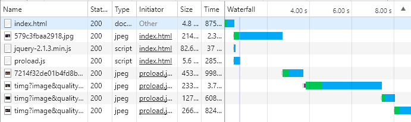
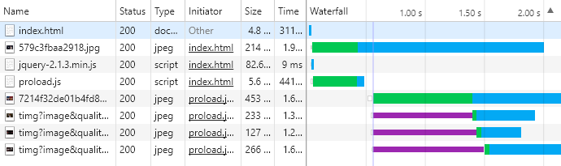

# lazyLoad-preLoad

### 一：预加载:事先把网页的图片加载到本地，之后就直接到缓存那里拿图片。
1.1 有序加载  

1.2 无序加载  

### 二：懒加载：当图片出现在可视化窗口之后，图片才加载到本地

> 原理：标签有一个属性是src，用来表示图像的URL，当这个属性的值不为空时，浏览器就会根据这个值发送请求。如果没有src属性，就不会发送请求。我们先不给设置src，把图片真正的URL放在另一个属性data-src中，在需要的时候也就是图片进入可视区域的之前，将URL取出放到src中。
